# 🤖 Build an AI Customer Support Agent with n8n, Pinecone & Groq

> An autonomous RAG-powered support agent that reads your inbox, understands your company docs, and replies to customers — in seconds, with zero human intervention.

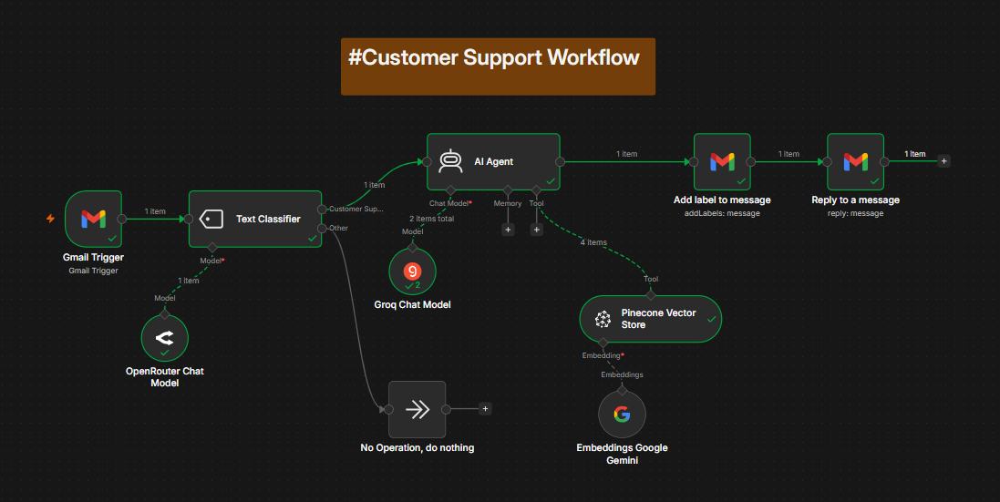

---

## 📖 Table of Contents

1. [Introduction & Problem Statement](#1-introduction--problem-statement)
2. [What We're Building](#2-what-were-building)
3. [How It Works — Architecture](#3-how-it-works--architecture)
4. [Tools & Why Each One Was Chosen](#4-tools--why-each-one-was-chosen)
5. [What You'll Need Before Starting](#5-what-youll-need-before-starting)
6. [Step-by-Step Build Guide](#6-step-by-step-build-guide)
   - [Step 1 — Set Up n8n](#step-1--set-up-n8n)
   - [Step 2 — Gmail Trigger](#step-2--gmail-trigger)
   - [Step 3 — Text Classifier](#step-3--text-classifier)
   - [Step 4 — OpenRouter Chat Model](#step-4--openrouter-chat-model)
   - [Step 5 — No Operation Node](#step-5--no-operation-node)
   - [Step 6 — AI Agent](#step-6--ai-agent)
   - [Step 7 — Groq Chat Model](#step-7--groq-chat-model)
   - [Step 8 — Pinecone Vector Store](#step-8--pinecone-vector-store)
   - [Step 9 — Google Gemini Embeddings](#step-9--google-gemini-embeddings)
   - [Step 10 — Add Label to Message](#step-10--add-label-to-message)
   - [Step 11 — Reply to a Message](#step-11--reply-to-a-message)
7. [Testing the Workflow](#7-testing-the-workflow)
8. [What You Learned](#8-what-you-learned)
9. [What You Could Build Next](#9-what-you-could-build-next)
10. [Screenshots](#10-screenshots)

---

## 1. Introduction & Problem Statement

Let me paint you a picture that probably sounds familiar.

A customer sends an email asking "Does my warranty cover accidental damage?" Someone on your support team has to open Gmail, find the warranty policy doc, read it, write a reply, and send it. Multiply that by 50 emails a day, and you've got a team spending half their time copy-pasting answers from the same documents over and over again.

The frustrating part? **The answers already exist.** They're sitting in your FAQ docs, your policy pages, your product manuals. The only problem is getting the right answer to the right customer, fast, without burning out your team on repetitive work.

That's exactly what this project solves. We're building an AI agent that:

- **Watches your inbox** like a tireless first-responder
- **Knows your company docs** inside and out (via a vector database)
- **Only responds to real support emails** — not newsletters or spam
- **Replies automatically**, in your brand's voice, within seconds

No ticket system required. No cloud AI subscription sending your customer data to OpenAI. Just a smart, efficient pipeline that works for you 24/7.

---

## 2. What We're Building

We're building a **Retrieval-Augmented Generation (RAG) Customer Support Pipeline** using n8n — a no-code/low-code workflow automation tool.

Here's what it does end to end:

1. A customer sends a support email to your inbox
2. The workflow wakes up the moment it arrives
3. An AI classifier quickly checks: is this a real support query, or just noise?
4. If it's noise (newsletter, spam, random email) — it's silently ignored, saving compute
5. If it's a real support query — the AI Agent kicks in
6. The agent searches your company's knowledge base (stored in Pinecone) for relevant policies/FAQs
7. It combines the customer's question with the retrieved company information
8. It writes a polite, accurate, context-aware reply
9. The reply gets sent back to the customer automatically, in the same email thread
10. The email gets labelled so you can track what was auto-handled

The whole thing takes about **6 seconds** from email received to reply sent. A human would take 5–10 minutes minimum.

---

## 3. How It Works — Architecture

```
┌─────────────────────────────────────────────────────────────────────┐
│                          GMAIL INBOX                                 │
│                    (new email arrives)                               │
└─────────────────────────┬───────────────────────────────────────────┘
                           │
                           ▼
              ┌────────────────────────┐
              │     Gmail Trigger       │
              │  Watches inbox 24/7     │
              │  Fires on every         │
              │  new email              │
              └────────────┬───────────┘
                           │
                           ▼
              ┌────────────────────────┐       ┌─────────────────────┐
              │    Text Classifier      │──────▶│  OpenRouter (LLM)   │
              │  "Is this a real        │       │  meta-llama-3-8b    │
              │   support email?"       │       │  (lightweight,      │
              └────────┬───────┬────────┘       │   fast, cheap)      │
                       │       │                └─────────────────────┘
               Customer│  Other│
               Support │  ↓    │
                       │  ┌────▼──────────────┐
                       │  │ No Operation       │
                       │  │ (silently ignore)  │
                       │  └────────────────────┘
                       │
                       ▼
              ┌────────────────────────┐       ┌─────────────────────┐
              │       AI Agent          │──────▶│  Groq Chat Model    │
              │  Reads the email,       │       │  llama-3.3-70b      │
              │  searches your docs,    │       │  (powerful, fast    │
              │  drafts a reply         │       │   reasoning)        │
              └────────┬───────────────┘       └─────────────────────┘
                       │ Tool
                       ▼
              ┌────────────────────────┐       ┌─────────────────────┐
              │  Pinecone Vector Store  │──────▶│  Google Gemini      │
              │  Your company's FAQ,    │       │  Embeddings         │
              │  policies, manuals      │       │  (converts text     │
              │  stored as vectors      │       │   into math the     │
              └────────────────────────┘       │   AI can search)    │
                                               └─────────────────────┘
                       │
                       ▼
              ┌────────────────────────┐
              │  Add Label to Message   │
              │  Tags email as handled  │
              └────────┬───────────────┘
                       │
                       ▼
              ┌────────────────────────┐
              │   Reply to Message      │
              │  Sends AI reply back    │
              │  in the same thread     │
              └────────────────────────┘
```

The key concept here is **RAG — Retrieval-Augmented Generation**. Instead of asking the AI to "just know" your company's policies (it can't — it wasn't trained on them), we:
1. Store your documents as searchable vectors in Pinecone
2. When a question comes in, retrieve the *relevant parts* of your docs
3. Give those retrieved chunks to the AI along with the customer's question
4. The AI generates an answer grounded in your actual documents

This means the AI can't hallucinate or make up policies — it can only use what you've actually uploaded.

---

## 4. Tools & Why Each One Was Chosen

| Tool | Role | Why This One |
|---|---|---|
| **n8n** | Workflow automation platform | Visual node-based builder, self-hostable, huge library of integrations, free to start |
| **Gmail Trigger** | Email listener | Native n8n integration, OAuth-based, reliable webhook alternative |
| **OpenRouter** | Powers the Text Classifier | Access to hundreds of models via one API key — we use a small, cheap model just for classification so we're not wasting the expensive model on a yes/no decision |
| **meta-llama-3-8b-instruct** | Classification model | Small enough to be near-instant and cheap, smart enough to reliably tell "customer support email" from "newsletter" |
| **Groq** | Powers the AI Agent | Groq runs inference on custom hardware (LPUs) that makes it dramatically faster than standard cloud GPUs — replies in ~1 second |
| **llama-3.3-70b-versatile** | Agent reasoning model | Large enough to understand nuanced customer questions and write professional replies, but runs blazing fast on Groq |
| **Pinecone** | Vector database for your docs | Purpose-built for semantic search at scale — stores your company docs as mathematical vectors so the AI can find relevant passages by meaning, not just keywords |
| **Google Gemini Embeddings** | Converts text to vectors | Free tier is generous, embeddings quality is excellent, native n8n integration makes setup simple |

---

## 5. What You'll Need Before Starting

Get these accounts and keys set up before you start building — it'll save you from stopping mid-flow:

- ✅ **n8n account** — [n8n.io](https://n8n.io) (cloud or self-hosted with `npx n8n`)
- ✅ **Gmail account** — connected to n8n via OAuth
- ✅ **OpenRouter account** + API key — [openrouter.ai](https://openrouter.ai)
- ✅ **Groq account** + API key — [console.groq.com](https://console.groq.com)
- ✅ **Pinecone account** + API key — [pinecone.io](https://pinecone.io)
- ✅ **Google AI Studio account** + API key (for Gemini Embeddings) — [aistudio.google.com](https://aistudio.google.com)
- ✅ Your company's **knowledge base documents** (FAQ, policies, manuals) — in any text format

---

## 6. Step-by-Step Build Guide

### Step 1 — Set Up n8n

If you're running n8n locally (the easiest way to start), open your terminal and run:

```bash
npx n8n
```

This starts n8n on `http://localhost:5678`. Open that in your browser. You'll see an empty canvas with an "Add first step" button in the center — this is where all your nodes will live.

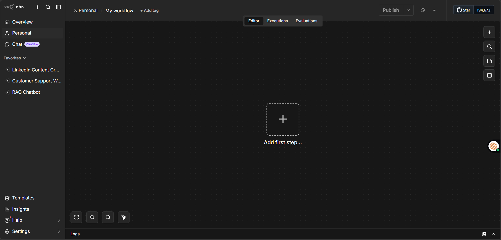

> **What's happening here:** n8n is a visual workflow builder. Each "node" is one step in your automation. You connect them left to right, and data flows through them like water through pipes. No code required — but you *can* write JavaScript expressions inside nodes for extra power (we'll use some of those later).

---

### Step 2 — Gmail Trigger

The Gmail Trigger is the starting point — the "ears" of your workflow. It watches your inbox and fires the rest of the workflow the moment a new email arrives.

**How to add it:**
1. Click "Add first step"
2. Search for "Gmail Trigger"
3. Click to add it to the canvas

**Configuration:**
- Click the node to open its settings
- Under **Connection**, click "Connect Gmail account"
- You'll be redirected to Google OAuth — sign in and grant permissions
- Set **Trigger on**: New Email
- Set **Simplify**: ON (gives you clean, readable email data instead of raw Gmail API response)

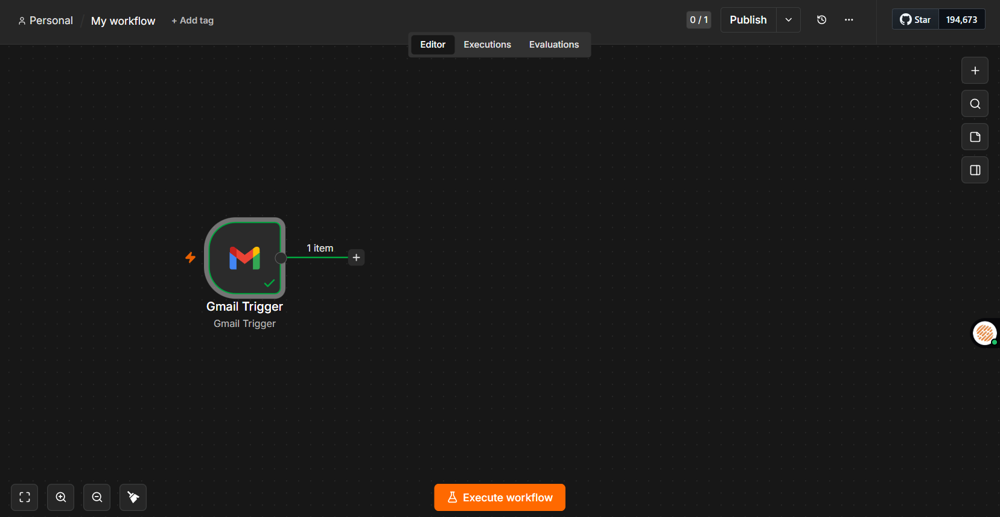

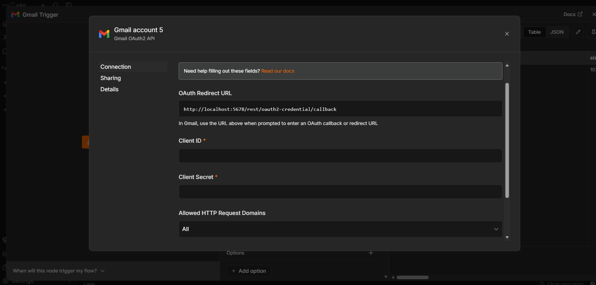

> **Why this node first?** Every workflow needs a trigger — something that kicks it off. We use Gmail Trigger instead of a scheduled "check every 5 minutes" approach because it's event-driven: the workflow fires *immediately* when an email arrives, not whenever the clock happens to tick. For customer support, speed matters.

**What data comes out of this node:**

When you click "Execute step" to test it, you'll see the email's raw data flow out: `id`, `threadId`, `subject`, `from`, `to`, `body text`, `labels`, `date`, and more. The most important field we'll use downstream is `$json.text` (the email body) and `$json.id` (the message ID, which we need to reply to the right thread).

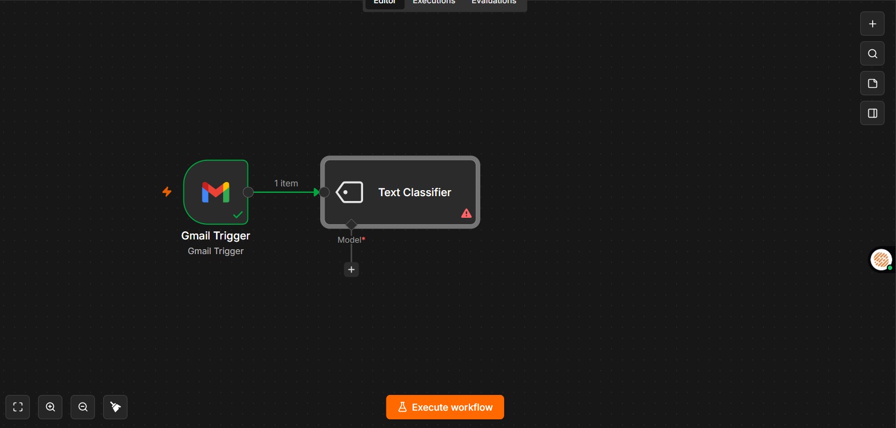

---

### Step 3 — Text Classifier

Here's where it gets interesting. Not every email in your inbox is a customer support query. You'll get newsletters, marketing emails, personal messages, automated notifications. We don't want the AI Agent processing all of those — it would waste compute, cost more money, and potentially send weird auto-replies to things that don't need one.

The Text Classifier solves this by acting as a smart bouncer: it reads each incoming email and makes a single decision — is this a real support query, or not?

**How to add it:**
1. Click the **+** on the right side of the Gmail Trigger node
2. Search for "Text Classifier"
3. Add it — it auto-connects to Gmail Trigger

**Configuration:**

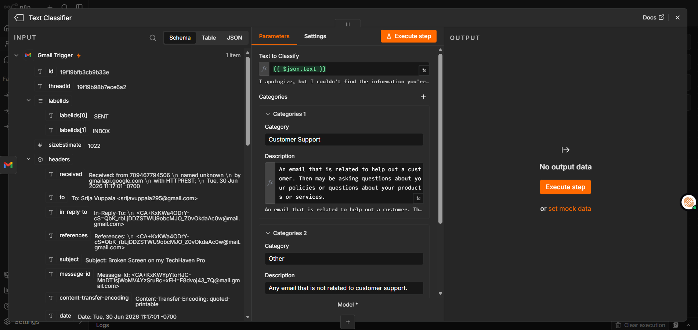

Open the Text Classifier node and configure:

- **Text to Classify**: `{{ $json.text }}` — this pulls the email body text from the Gmail Trigger output
- **Categories**:
  - Category 1: `Customer Support` — Description: *"An email that is related to help out a customer. They may be asking questions about your product, policies, or services."*
  - Category 2: `Other` — Description: *"Any email that is not related to customer support."*

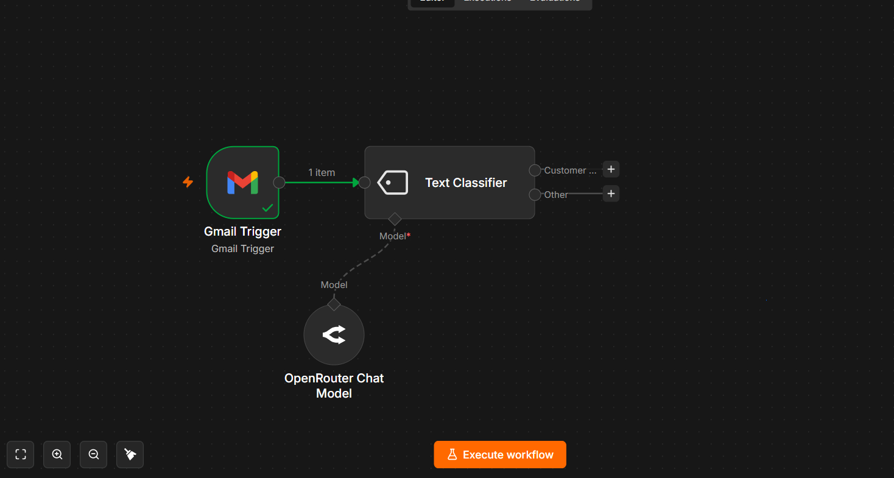

> **Why two categories and not just one?** The classifier needs contrast to make a decision. If you only tell it what "Customer Support" looks like, it has nothing to compare against. By defining "Other" explicitly, you're giving it a clear mental model: *"If it matches Customer Support, go left. If it matches Other, go right."* This binary routing pattern is fundamental to building reliable AI pipelines — you'll see it everywhere.

The Text Classifier node automatically creates two output branches: one labeled "Customer Support" and one labeled "Other." We'll connect each to something different next.

---

### Step 4 — OpenRouter Chat Model

The Text Classifier is smart, but it needs an actual AI model to do the classification. That's what this node provides. We're attaching a lightweight language model via OpenRouter as the "brain" for the classifier.

**How to add it:**
1. Click the **+** icon under "Model*" at the bottom of the Text Classifier node
2. Search for "OpenRouter Chat Model"
3. Add it — it connects as a sub-node (model provider) to the Text Classifier

**Configuration:**

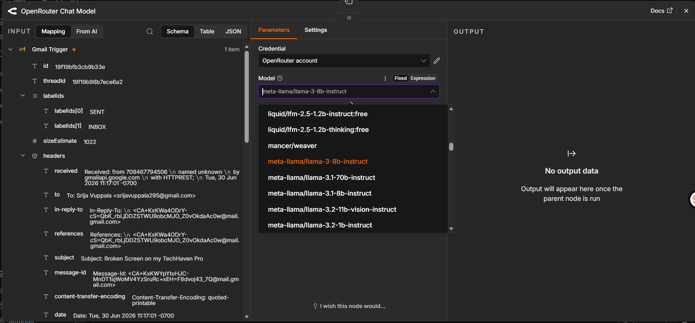

- **Credential**: Click "Create new credential" → paste your OpenRouter API key
- **Model**: `meta-llama/llama-3-8b-instruct`

> **Why a small model here?** The Text Classifier is just doing a yes/no decision — "is this customer support or not?" That doesn't need GPT-4 level intelligence. A small, fast, cheap model like Llama 3 8B handles this perfectly. By using a lightweight model for classification and saving the big model for the actual reply generation, we keep costs low and speed high. This is a real-world optimization pattern called **model cascading** — use the smallest model that can reliably do each job.

---

### Step 5 — No Operation Node

Remember the "Other" branch from the Text Classifier? We need to connect it to something, or n8n will complain that it's unconnected. For emails that aren't customer support queries, we simply want to do nothing — let them sit in the inbox untouched.

**How to add it:**
1. Click the **+** on the "Other" output branch of the Text Classifier
2. Search for "No Operation, do nothing"
3. Add it

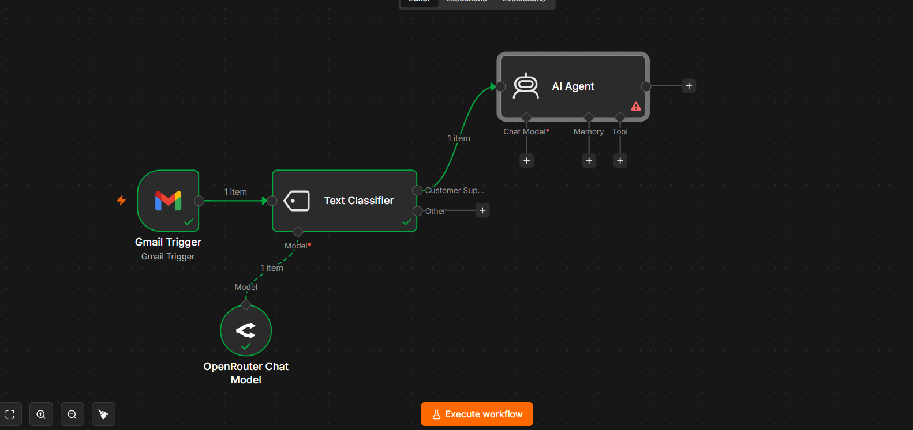

> **Why not just leave the "Other" branch unconnected?** In production workflows, unconnected branches can cause warnings and sometimes errors depending on the n8n version. More importantly, being explicit about "do nothing" makes the workflow easier to read and understand when you come back to it 3 months later. It's like adding a comment in code — "we intentionally ignore this case."

---

### Step 6 — AI Agent

This is the core of the entire system — the brain that actually understands the customer's problem, searches your knowledge base, and writes the reply.

**How to add it:**
1. Click the **+** on the "Customer Support" output branch of the Text Classifier
2. Search for "AI Agent"
3. Add it

**Configuration:**

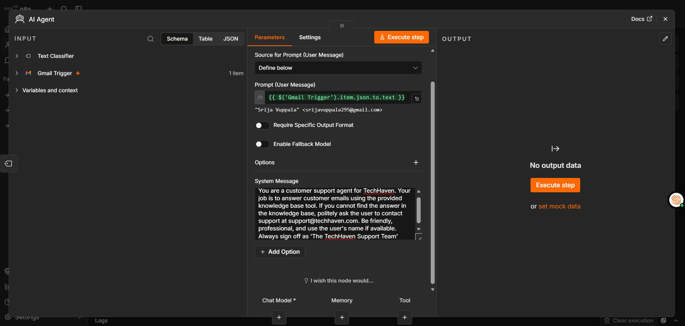

Open the AI Agent node:

- **Source for Prompt (User Message)**: Select "Define below"
- **Prompt (User Message)**:
```
{{ $("Gmail Trigger").item.json.to.text }}
```
This pulls the full email text directly from the Gmail Trigger output — it's the customer's actual message that the agent needs to answer.

- **System Message** (this is your agent's personality and rules — write it like you're briefing a new employee):
```
You are a customer support agent for TechHaven. Your job is to answer 
customer emails using the provided knowledge base tool. If you cannot 
find the answer in the knowledge base, politely ask the user to contact 
support at support@techhaven.com. Be friendly, professional, and use 
the user's name if available. Always sign off as 'The TechHaven Support Team'.
```

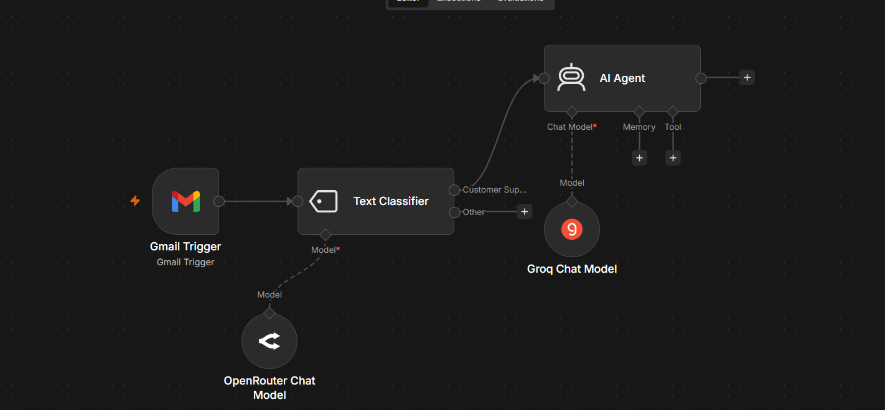

> **Why does the system prompt matter so much?** The system prompt is the difference between a generic AI reply and a branded, professional one. Without it, the AI might sign off as "AI Assistant" or give a cold, robotic response. The system prompt defines the agent's identity, constraints ("only use the knowledge base"), tone ("friendly, professional"), and fallback behaviour ("direct to support email if unsure"). Think of it as the job description you'd give a new support hire on Day 1.

> **What's `$("Gmail Trigger").item.json.to.text`?** This is an n8n expression — a small piece of JavaScript wrapped in `{{ }}`. It reaches back to the Gmail Trigger node by name, grabs the current item's JSON data, and extracts the `to.text` field (the full email body). You'll use expressions like this constantly in n8n to pass data between nodes.

---

### Step 7 — Groq Chat Model

Just like the Text Classifier needed a model, the AI Agent needs one too — but this time we want a powerful, fast model capable of reading a customer email, reasoning about it, searching for relevant docs, and writing a polished reply.

**How to add it:**
1. Click the **+** under "Chat Model*" at the bottom of the AI Agent node
2. Search for "Groq Chat Model"
3. Add it

**Configuration:**

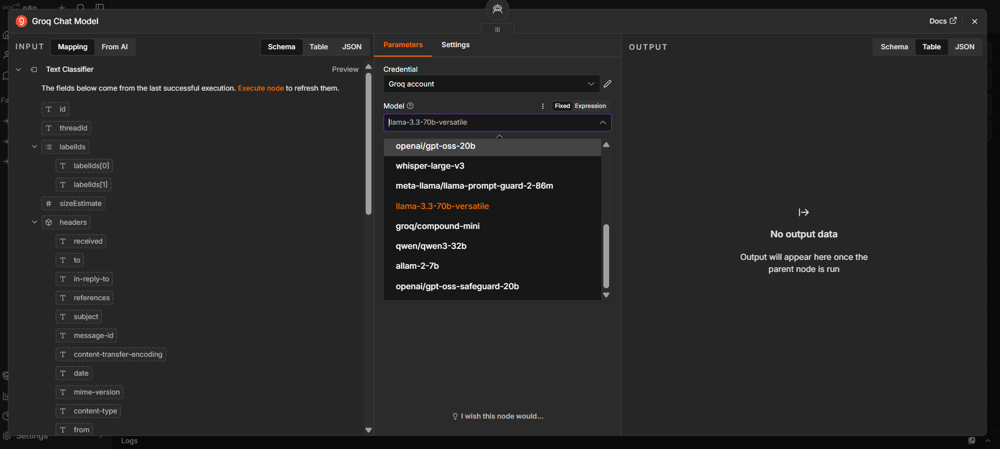

- **Credential**: Click "Create new credential" → paste your Groq API key
- **Model**: `llama-3.3-70b-versatile`

> **Why Groq specifically, and not OpenAI or Anthropic?** Three reasons: speed, speed, and speed. Groq runs models on custom LPU (Language Processing Unit) hardware that's specifically designed for fast inference — we're talking token generation speeds 5–10x faster than standard GPU-based providers. For a customer support agent where response time matters, this is a meaningful advantage. And `llama-3.3-70b-versatile` is a fully open-weight model running on Groq's infrastructure, so you're not locked into a single company's API.

---

### Step 8 — Pinecone Vector Store

This is the knowledge layer — where your company's documents live in a form the AI can search semantically. Instead of keyword matching ("does this document contain the word 'warranty'?"), Pinecone stores your docs as mathematical vectors and finds the most *semantically similar* content to the customer's question ("what parts of these docs talk about what happens when a product breaks?").

**First, set up your Pinecone index:**

1. Go to [pinecone.io](https://pinecone.io) and create an account
2. Click "Create Index"
3. Name it `codedex` (or anything you like — just remember it)
4. Under Configuration, select **llama-text-embed-v2** as the embedding model
5. Leave other settings as default → click "Create Index"
6. Once created, go to your index → click "Namespace" → create a namespace called `techhaven`

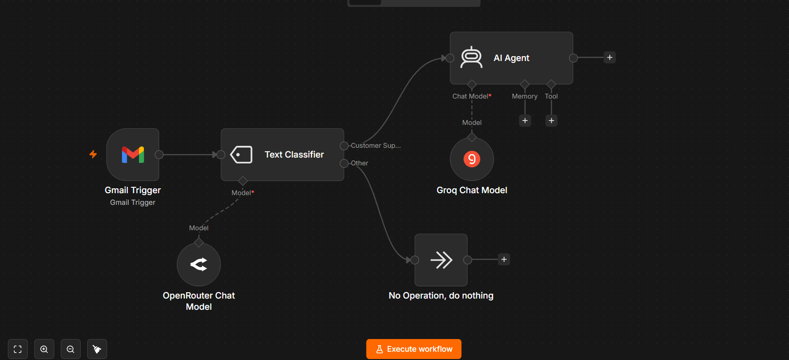

> **What's a namespace?** Think of your Pinecone index as a database, and namespaces as tables within it. If you had multiple clients or products, each could have its own namespace — so TechHaven's policies live in `techhaven` and don't get mixed up with another client's docs. Clean and organised.

**Upload your company documents:**

Before the AI can search your docs, you need to get them into Pinecone. The cleanest way in n8n is to build a separate one-time "ingestion workflow":
1. Load your documents (from Google Drive, a URL, or plain text)
2. Split them into chunks (n8n's "Recursive Character Text Splitter" node works well)
3. Run them through Google Gemini Embeddings to convert to vectors
4. Insert them into Pinecone

For this tutorial, we've pre-loaded TechHaven's warranty policy, return policy, and FAQ into the `techhaven` namespace.

**Now add the Pinecone Vector Store node to the AI Agent:**

1. Click the **+** under "Tool" on the AI Agent node
2. Search for "Pinecone Vector Store"
3. Add it — it connects as a tool the AI Agent can call

**Configuration:**

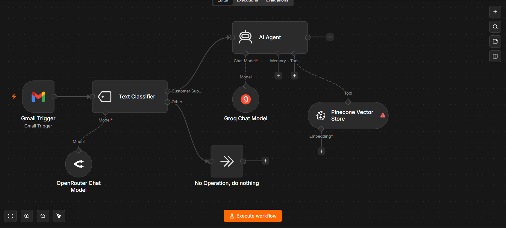

- **Credential**: Your Pinecone API key
- **Operation Mode**: `Retrieve Documents (As Tool for AI Agent)`
- **Description**: `Call this tool to access FAQ and policy information` — this description is read by the AI Agent to decide *when* to use this tool. Make it clear and action-oriented.
- **Pinecone Index**: Select `codedex` from the dropdown
- **Namespace**: `techhaven`
- **Limit**: `4` — retrieve the 4 most relevant document chunks per query
- **Include Metadata**: ON
- **Rerank Results**: ON

> **Why "Retrieve Documents (As Tool for AI Agent)" mode?** Pinecone has two operation modes in n8n: one where it always retrieves (good for simple pipelines) and "As Tool for AI Agent" mode where the Agent decides *when* to call it and *what* to search for. This second mode is smarter — the Agent reads the customer's question, decides what to search for ("warranty policy for accidental damage"), queries Pinecone with that specific search, gets back the most relevant chunks, and uses those to answer. It's the difference between a fixed lookup and actual reasoning.

---

### Step 9 — Google Gemini Embeddings

Pinecone stores documents as vectors (arrays of numbers). To search those vectors, the incoming query also needs to be converted into a vector — using the *same* embedding model that was used when the documents were originally stored. That's what this node does.

**How to add it:**
1. Click the **+** under "Embedding*" at the bottom of the Pinecone Vector Store node
2. Search for "Embeddings Google Gemini"
3. Add it

**Configuration:**

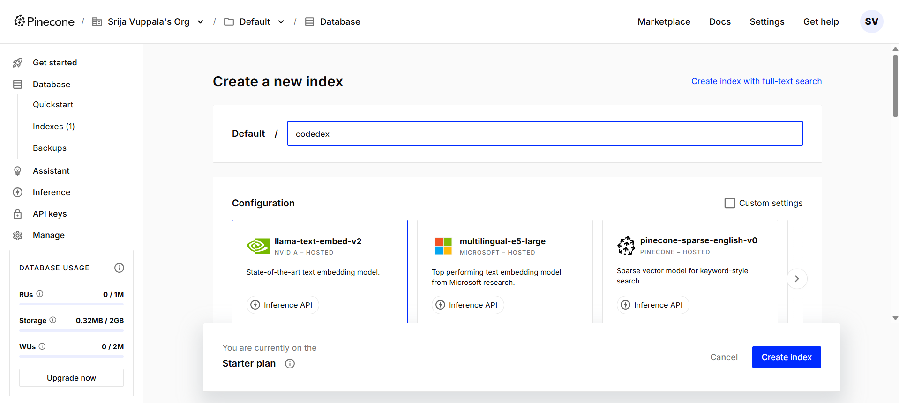

- **Credential**: Your Google AI Studio API key
- **Model**: Leave as default (`text-embedding-004` or whatever's current)

> **Why does the embedding model need to match?** Imagine storing your documents in French and then searching them in Japanese — the words wouldn't overlap at all. Embedding models work similarly: each model produces its own "coordinate system" for meaning. If you stored docs using Gemini embeddings, you must also embed the search query using Gemini, so both are in the same coordinate space and similarity search actually works.

---

### Step 10 — Add Label to Message

Once the AI Agent has generated a reply, we want to tag the original email so we know it's been handled automatically. This is useful for your inbox organisation and for tracking what the agent is processing.

**How to add it:**
1. Click the **+** on the right side of the AI Agent node
2. Search for "Gmail" → select the Gmail node
3. Set Operation to "Add Label"

**Configuration:**

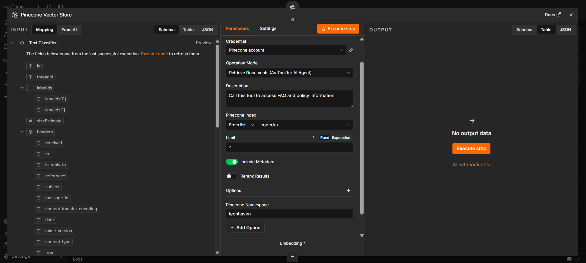

- **Credential**: Your Gmail account (same one as the trigger)
- **Resource**: Message
- **Operation**: Add Label
- **Message ID**: `{{ $("Gmail Trigger").item.json.id }}` — this makes sure we label the *original* incoming email, not any other message
- **Label Names or IDs**: `CATEGORY_FORUMS` (or create a custom label like "AI-Handled" in Gmail first and use that)

> **Why label it?** Two reasons: first, it gives you a clear visual in your inbox showing which emails were handled automatically vs. which still need human attention. Second, if something ever goes wrong (the agent gives a bad answer), you can filter by this label and review/follow-up. It's a simple but important operational detail that separates a "demo" workflow from a production-ready one.

---

### Step 11 — Reply to a Message

The final node — this takes the AI Agent's generated reply and actually sends it back to the customer, threaded as a reply to their original email.

**How to add it:**
1. Click the **+** on the right side of the "Add Label" node
2. Search for "Gmail" → select the Gmail node
3. Set Operation to "Reply"

**Configuration:**

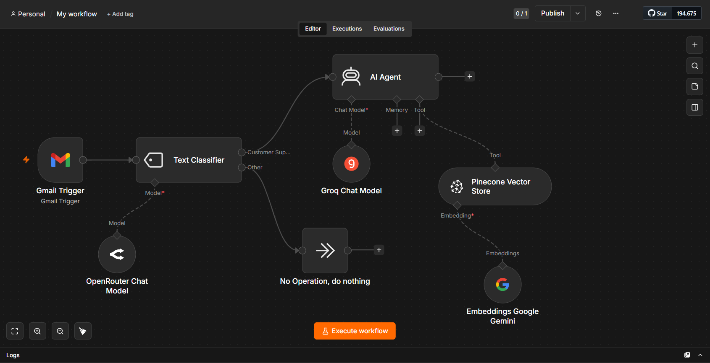

- **Credential**: Your Gmail account
- **Resource**: Message
- **Operation**: Reply
- **Message ID**: `{{ $("Gmail Trigger").item.json.id }}` — replies to the original thread
- **Email Type**: Text
- **Message**: `{{ $("AI Agent").item.json.output }}` — this pulls the AI Agent's generated text as the reply body

> **Why `$("AI Agent").item.json.output`?** The AI Agent node stores its final generated response in a field called `output` inside the `json` object. This expression reaches back to grab exactly that text and uses it as the email body. The `$("Node Name")` pattern is how you reference any previous node's data in n8n — you'll use this constantly.

> **One important thing:** make sure this Gmail account has "Send" permissions. The OAuth scope needs to include `https://www.googleapis.com/auth/gmail.send`. If you connected Gmail with "read only" permissions earlier, you'll need to reconnect with full permissions.

---

## 7. Testing the Workflow

Now the moment of truth. Here's how to test the whole pipeline end to end:

**Step 1 — Activate the workflow**

Click the toggle in the top right corner of n8n to set the workflow from "Inactive" to "Active." This means it's now listening for real emails.

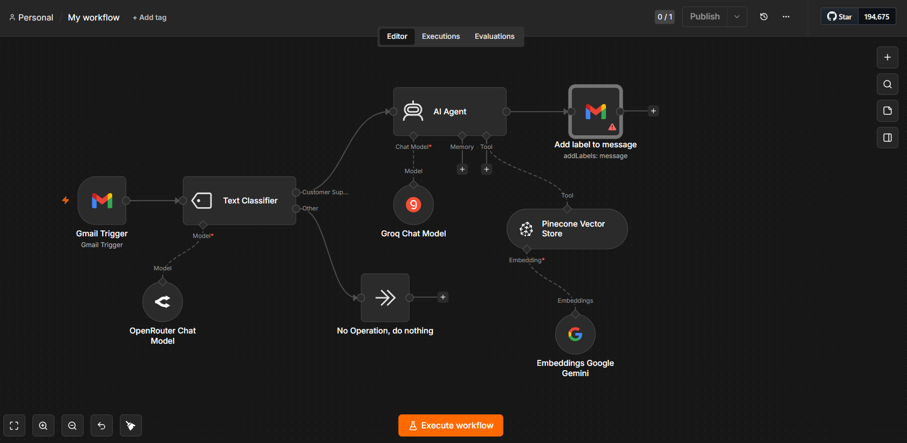

**Step 2 — Send a test email**

Send an email to the Gmail address you connected in the trigger. Use a realistic customer support scenario — something like:

> *Subject: Broken Screen on my TechHaven Pro*
> *Hi TechHaven Support, I dropped my device yesterday and the screen cracked. I bought it three months ago. Does my warranty cover accidental damage, and how can I get a replacement? Please help*

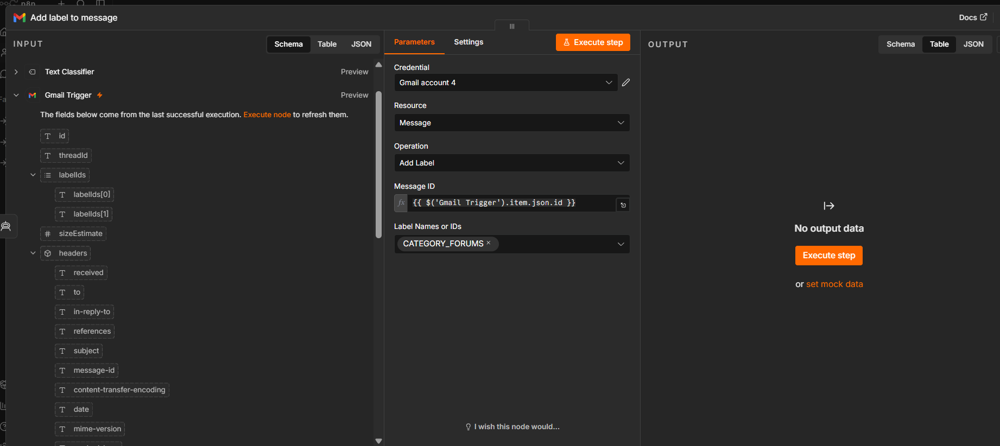

**Step 3 — Watch it run**

Go back to n8n. Within a few seconds (Gmail polling interval), you should see the workflow light up with green checkmarks flowing from left to right — Gmail Trigger fires, Text Classifier routes to "Customer Support," AI Agent searches Pinecone, generates a reply, labels the email, and sends the reply.

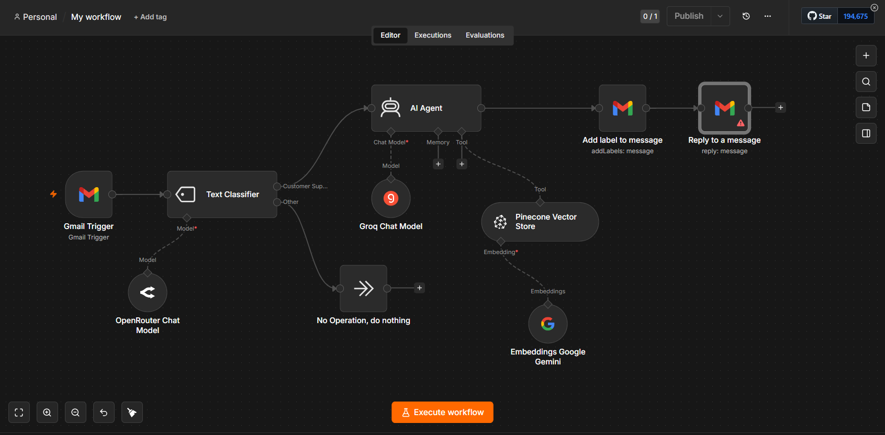

**Step 4 — Check your inbox**

Go back to Gmail. You should see the AI's reply already in the thread — within the same minute you sent the test email.

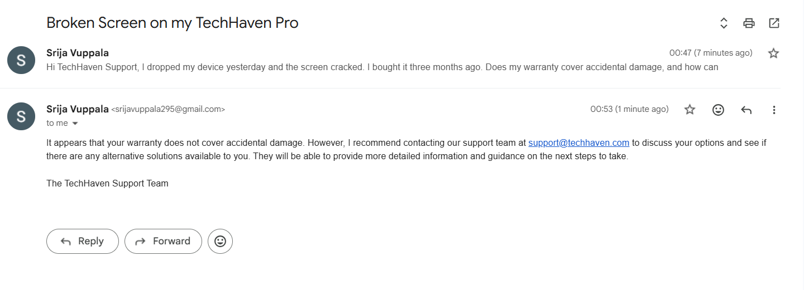

The reply should be:
- Accurate (based on your actual uploaded policies)
- Branded (signed off as "The TechHaven Support Team")
- Professional in tone
- Relevant to the specific question asked (warranty + accidental damage)

---

## 8. What You Learned

By building this workflow, you now understand:

1. **RAG (Retrieval-Augmented Generation)** — how to ground an AI's answers in your actual documents instead of its training data, preventing hallucinations
2. **Model cascading** — using a cheap, small model for simple decisions (classification) and reserving a powerful model for complex tasks (reply generation)
3. **Vector databases** — what Pinecone is, what embeddings are, and why semantic search is more powerful than keyword search
4. **n8n expressions** — how to pass data between nodes using `{{ $("Node Name").item.json.field }}` syntax
5. **AI Agent tool use** — how to give an AI Agent "tools" it can call (like Pinecone) to augment its reasoning with external data
6. **Event-driven automation** — building pipelines that respond to real-world events (email arriving) rather than running on a fixed schedule
7. **Production thinking** — the "No Operation" node, the label system, error handling patterns — details that separate a prototype from something you'd actually run in production

---

## 9. What You Could Build Next

- **Multi-inbox support** — route emails from different products/brands into different Pinecone namespaces with different agent personas
- **Escalation logic** — if the AI's confidence is low, route to a human instead of auto-replying
- **Sentiment detection** — if the customer seems angry or distressed, flag for immediate human review
- **Ticket creation** — after replying, automatically create a support ticket in Jira/Linear/Notion for your team's records
- **Slack notifications** — ping your team in Slack every time the agent handles an email, with a summary of what was asked and what was answered
- **Analytics dashboard** — log every interaction to a Google Sheet and build a simple dashboard tracking common questions, resolution rate, and response times

---

## 10. Screenshots

| Step | Screenshot |
|---|---|
| 1. n8n Empty Canvas |  |
| 2. Gmail Trigger Added |  |
| 3. Gmail OAuth Setup |  |
| 4. Gmail Trigger Output Data |  |
| 5. Text Classifier Connected |  |
| 6. Text Classifier Configuration |  |
| 7. OpenRouter Chat Model |  |
| 8. No Operation Node |  |
| 9. AI Agent Connected |  |
| 10. AI Agent System Prompt |  |
| 11. Groq Chat Model |  |
| 12. Pinecone Index Setup |  |
| 13. Pinecone Vector Store Config |  |
| 14. Google Gemini Embeddings |  |
| 15. Add Label to Message |  |
| 16. Reply to Message Config |  |
| 17. Final Workflow Active |  |
| 18. Test Email Sent |  |
| 19. Workflow Executing |  |
| 24. AI Reply in Gmail |  |

---

Built for the [Codédex](https://codedex.io) Project Tutorial Monthly Challenge 🌱

*Questions? Drop a comment below — happy to help you get your own version running!*#
